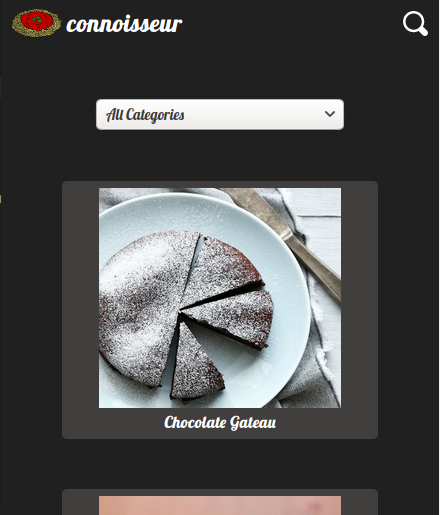
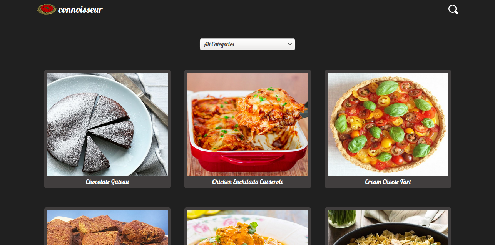
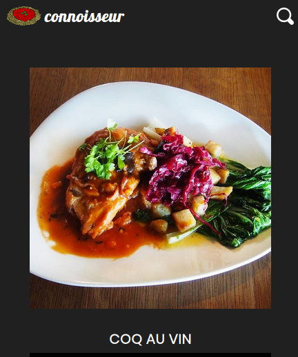
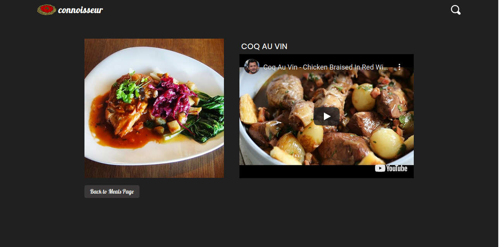

[![Contributors][contributors-shield]][contributors-url]
[![Issues][issues-shield]][issues-url]
 

 
  <h2 align="center">Connoisseur</h2>
  

     
    <a href="https://github.com/fegzycole/React-Redux-Capstone/"><strong>Explore the docs »</strong></a>
     
     
    ·
    <a href="https://github.com/fegzycole/React-Redux-Capstone/issues">Report Bug</a>
    ·
    <a href="https://github.com/fegzycole/React-Redux-Capstone/issues">Request Feature</a>
  

<!-- TABLE OF CONTENTS -->
## Table of Contents

* [About the Project](#about-the-project)
  * [Built With](#built-with)
  * [Prerequisites](#prerequisites)
* [Credit](#credit)
* [Screenshots](#screenshots)
* [Roadmap](#roadmap)
* [License](#license)
* [Contact](#contact)

<!-- ABOUT THE PROJECT -->
## About The Project

A single page application built with react which fetches information about different meal recipes and displays them in a catalogue.

### Built With

- Create-react-app
- Redux
- React-Router
- Webpack
- Babel

## Prerequisites
 - Git
 - Yarn
 - Node.js
 - NPM

## Credit

- [Marc Antoine Roy](https://www.behance.net/enfantroy)

## Screenshots

### Meals Page

### Sample Meal Page

## Getting Started

- git clone https://github.com/fegzycole/React-Redux-Capstone.git

- cd React-Redux-Capstone

- npm install

- npm start

## Live Version

- You can view the app [Here](https://react-redux-client.herokuapp.com//)

<!-- ROADMAP -->
## Roadmap

See the [open issues](https://github.com/fegzycole/React-Redux-Capstone/issues) for a list of proposed features (and known issues).

<!-- LICENSE -->
## License

Distributed under the MIT License. See `LICENSE` for more information.

<!-- CONTACT -->
## Contact
Ferguson Iyara - [Github profile](https://github.com/fegzycole)

Project Link: [Project repo](https://github.com/fegzycole/Rails-capstone)

<!-- MARKDOWN LINKS & IMAGES -->
<!-- https://www.markdownguide.org/basic-syntax/#reference-style-links -->
[contributors-shield]: https://img.shields.io/badge/Contributors-1-%2300ff00
[contributors-url]: https://github.com/fegzycole/React-Redux-Capstone/graphs/contributors
[issues-shield]: https://img.shields.io/badge/issues-0-%2300ff00
[issues-url]: https://github.com/fegzycole/React-Redux-Capstone/issues/